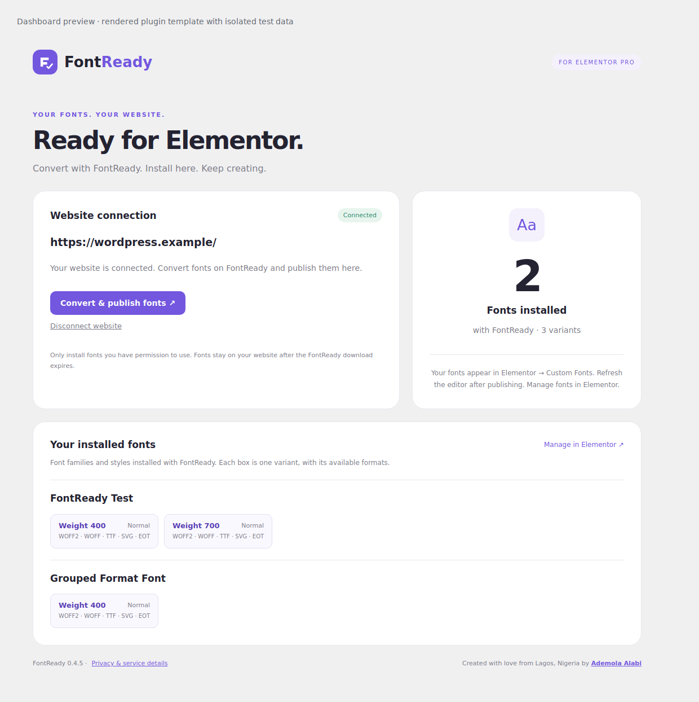

# FontReady for Elementor Pro

**Convert a font. Approve your WordPress site. Publish it into Elementor Pro Custom Fonts.**

Built by [Ademola Alabi](https://ademolaalabi.com/) · PHP / WordPress REST API / Elementor Pro · GPL-2.0-or-later

[Live product](https://fontready.com/) · [Elementor publishing flow](https://fontready.com/font-to-elementor-pro/) · [Architecture](docs/ARCHITECTURE.md) · [Security and privacy](docs/SECURITY.md) · [Reviewer guide](docs/REVIEWER_GUIDE.md)

## The problem

Installing a custom font in Elementor involves more than converting a file. A designer still needs to move the output to WordPress, create a Custom Fonts family, and associate files with the correct weights and styles.

FontReady connects conversion to installation. This repository contains the WordPress plugin that accepts an approved publishing request, validates the font assets, and registers them in Elementor Pro's native Custom Fonts manager. The companion website performs conversion.

## Product decisions

- **No FontReady account to create:** approval happens through the site's WordPress administrator account.
- **Native Elementor records:** font families, variant rows and media attachments remain manageable inside WordPress.
- **One family, multiple weights:** separate uploads using the same family name add matching weight/style rows. Retrying a variant does not create another family.
- **Five formats per variant:** WOFF2, WOFF, TTF, SVG and EOT share the same weight/style row.
- **Local ownership:** installed files are hosted on the WordPress site. Expiring a conversion download does not remove installed fonts.
- **Recoverable publishing:** small authenticated upload pieces, checksum verification and idempotent receipts support retries.

## Dashboard preview



*Rendered from the actual plugin dashboard template with isolated test data and a minimal page shell. This is a UI preview, not a screenshot of a live WordPress/Elementor installation or evidence of customer adoption.*

## Install and try it

Requirements: WordPress 6.2 or later, PHP 7.4 or later, active Elementor Pro, HTTPS, writable WordPress uploads, and a writable private system temporary directory outside the WordPress installation.

1. Download [fontready-wordpress.zip](fontready-wordpress.zip) from this repository, or build it with `python scripts/build.py`.
2. In WordPress, open **Plugins → Add New → Upload Plugin**, select the ZIP and activate FontReady.
3. Open [FontReady's Elementor page](https://fontready.com/font-to-elementor-pro/) and upload a font you have permission to embed.
4. Choose **Publish to Elementor Pro website**, enter the site URL, and approve the connection as a WordPress administrator.
5. Open **Elementor → Custom Fonts** to inspect the family and its variants. Refresh the editor before selecting the font.

You can revoke publishing access from the FontReady dashboard in WordPress. The automatically generated connection expires after seven days; there is no key to copy manually.

## Engineering overview

| Responsibility | Implementation |
| --- | --- |
| Administrator approval, REST authorization, import orchestration and dashboard | [fontready/fontready.php](fontready/fontready.php) |
| Metadata, size and file-structure validation | [validation.php](fontready/includes/validation.php) |
| Private staging, ordered upload pieces, SHA-256 and retry receipts | [transfer.php](fontready/includes/transfer.php) |
| Native families, attachments, variant merging and rollback | [elementor.php](fontready/includes/elementor.php) |
| Real generated font fixtures and isolated PHP contracts | [scripts/check.py](scripts/check.py), [tests/plugin.php](tests/plugin.php) |

See the [reviewer guide](docs/REVIEWER_GUIDE.md) for a focused code walkthrough and the [architecture guide](docs/ARCHITECTURE.md) for the transfer boundary and persistence model.

## Run the checks

Install PHP CLI and Python 3.12, then:

```sh
pip install -r requirements-dev.txt
python scripts/check.py
python scripts/build.py
```

For a PHP executable outside PATH:

```sh
PHP_BINARY=/absolute/path/to/php python scripts/check.py
```

The standard suite generates real TTF, OTF, WOFF and WOFF2 fixtures, plus grouped SVG/EOT assets, and runs isolated PHP contracts with WordPress and Elementor doubles. On 8 October 2026, the reviewed source passed PHP syntax checks and **98 contract checks** locally. This does not establish live compatibility.

An optional contract can load separately supplied Elementor Pro source:

```sh
ELEMENTOR_PRO_SOURCE=/absolute/path/to/elementor-pro python scripts/check.py
```

Vendor source is not included. The companion JavaScript contract in `integration/check_wordpress_ui.cjs` requires the companion website's `static/` files; it is not part of the standalone PHP test command.

## Current scope and limitations

- Version **0.4.5**. WordPress.org approval/distribution is not established by this repository.
- The adapter calls Elementor's internal PHP Custom Fonts interface. Live Elementor compatibility and rendering remain **unverified in this review**; tests use doubles unless vendor source is explicitly supplied.
- Matching depends on the supplied family name, weight and style. Different family spellings are not automatically reconciled.
- OTF can be a conversion input, but direct OTF persistence through this native adapter is unsupported.
- Validation checks bounded metadata and selected file structures; it is not a full font-parser or malware audit.
- Payload limits apply per import, not as a lifetime storage quota.
- The website and WordPress must both be reachable; hosting cold starts and site security policies can affect publishing.
- Abrupt process termination can leave option-based locks requiring recovery; rollback handles caught failures rather than providing a database transaction.

[Security details and review scope](docs/SECURITY.md) · [Implementation/version notes](docs/IMPLEMENTATION_NOTES.md) · [WordPress.org submission plan](docs/WORDPRESS_ORG_SUBMISSION.md)

FontReady is independent and is not affiliated with or endorsed by Elementor.

Created with love from Lagos, Nigeria by **Ademola Alabi**.

