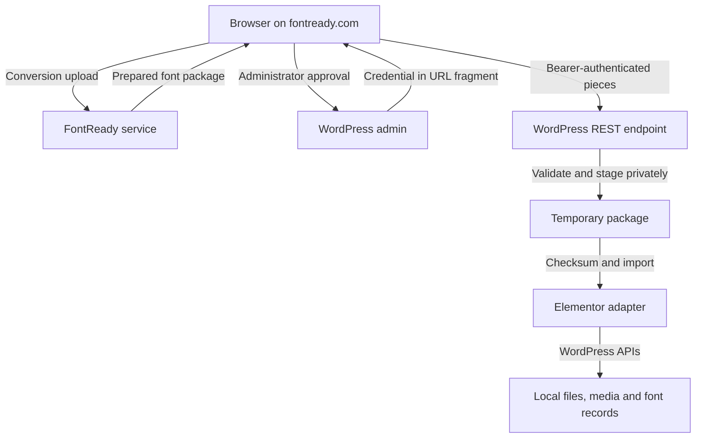

# Architecture

The WordPress plugin is the installation boundary. The companion FontReady website converts uploaded fonts; this plugin authorizes publishing and stores validated results on the destination site.

## Trust boundaries

The plugin's approval callback uses a fixed FontReady destination. A random 32-byte credential is returned in the URL fragment, while only its SHA-256 hash is stored in the connection option. The companion browser flow is intended to store the credential in tab session storage and send it directly to WordPress; review the deployed companion code separately before asserting its production behavior.

## Approval and REST authorization

The administrator POST checks a WordPress nonce, confirmation, HTTPS, Elementor Pro activation, and both `manage_options` and `upload_files`. The resulting connection lasts seven days.

Every registered publishing/status route uses `authorize()`: credential shape, stored hash, expiration and the approving user's current capabilities are checked. A supplied Origin must match `https://fontready.com`; absent Origin is accepted with a valid bearer credential. CORS alone is not the authorization mechanism.

## Transfer and import

1. Transfer version 2 serializes the version 1 font package into pieces of at most 128 KiB.
2. WordPress stages one upload per connection in a system temporary file outside its installation, with mode 0600.
3. The transfer binds its state to the connection hash and records sequence, checksum, offset and expiration.
4. The most recently acknowledged piece can be retried without appending duplicate bytes. Commit retries return the stored receipt.
5. Commit requires all pieces and a matching SHA-256, then calls the same validated import path.
6. Import validates all font entries before writing assets, obtains an option-based lock, writes local files, synchronizes native records and saves its registry.
7. Caught failures invoke adapter rollback and remove newly written files. Successful replacement removes obsolete assets.

Temporary staging expires after ten minutes. Cleanup runs on subsequent requests, scheduled WordPress cron, disconnect or deactivation; cron execution timing depends on the site.

## Persistence

| Store | Purpose |
| --- | --- |
| `fontready_connection` | Credential hash, approving user, connection and expiry times |
| `fontready_transfer` | Private upload progress and completed receipt |
| `fontready_fonts` | Imported asset registry and native record references |
| `uploads/fontready/` | Public installed font assets |
| WordPress media attachments | Native references for each format |
| Elementor Custom Fonts posts and metadata | Families with weight/style rows |

The identity key includes family, weight, style and format. A face groups formats by family, weight and style. Exact family names drive native family lookup.

The adapter uses the installed Custom Fonts object's `save_meta()` to generate metadata/CSS. It marks plugin-owned families, refuses to overwrite unrelated families, preserves administrator-added variant rows, and filters registry entries against current native rows so deletions in Elementor are respected.

## Boundaries to review further

This integration relies on an internal Elementor interface. A live compatibility matrix, variable-font editing, concurrent publishing under a real database, crash recovery and a persistent storage quota require further verification or implementation. The isolated suite establishes the modeled contracts, not a live WordPress deployment.

